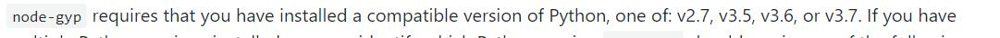

## 项目运行所需环境
### 1，必须安装nodejs
附上node下载地址-[Nodejs](http://nodejs.cn/download/)

node安装过程简单， 一直next就行了，我安装的版本是12.16.1，可以在powershell中通过` node -v`来查看当前版本

### 2，安装nod-gyp
node-gyp是用来编译c++模块的工具，这里用来编译serialport，
node-gyp的github文档-[node-gyp文档](https://github.com/nodejs/node-gyp)

全局安装 `npm install -g node-gyp`

#### 来看这一段来自官方文档的说明
![]./(README_files/8.jpg)

#### 大致意思就是有两种方案：
**一种是**下载windows-build-tools,通过命令`npm install --global --production windows-build-tools`,但是要注意
的是必须以管理员的身份启动CMD窗口或者是PowerShell窗口，这种方案下载的东西较少

**还有一种是**要下载Visual Studio和python，这种方案下载的东西就很多了，但是我以前电脑装过VisualStudio并且以后或许会用到
所以我选了第二种方案

### 3、安装visual studio 2017
附上visual studio下载地址[Visual Studio 2017 Community](https://visualstudio.microsoft.com/pl/thank-you-downloading-visual-studio/?sku=Community)
安装VS的时候选项如下，要勾选使用c++桌面开发，node-gyp文档上也有提示

安装完成之后执行一下命令

`npm config set msvs_version 2017`

### 4、安装python2.7
附上python下载地址-[Python2.7x](https://www.python.org/downloads/windows/)

python安装注意版本要下载相应的版本 百度了一下说python3.x不支持，为了避免不必要的问题干脆直接装python2.7，
具体安装过程记不清了，网上教程很多，大同小异，照着过程安装一遍就行。

安装完成之后执行命令

`npm config set python python2.7`

可以在powershell中使用命令`python --version`来查看安装好的版本

## 项目的安装与使用
### clone到本地
`git clone https://github.com/BaiFangZi/electron-serialport.git`
### 切换到项目目录
`cd electron-serialport`
### 下载相应的依赖
npm下载由于网速或者被墙会造成下载失败，推荐使用cnpm

`npm install`或者`cnpm install`

下载成功后的提示信息

由于node版本和electron版本不匹配，所以直接启动会报错，这个时候要执行下面这两个命令来解决这个问题

`cd ./node_modules/@serialport/bindings`

`node-gyp rebuild --target=6.0.10 --arch=x64 --dist-url=https://npm.taobao.org/mirrors/atom-shell`

然后再返回根目录 `cd ../../../`

启动项目 `npm start`

## 项目打包生成exe文件

我使用的是electron-builder来打包 打包命令

`npm run dist`

在package.json文件中可以更改build属性来配置相应的打包选项

打包过程极有可能被墙，针对这种情况我们可以复制链接然后在浏览器中下载相应的被墙的文件，再手动添加到目录中

详细过程可以看这篇文章 [解决下载依赖出错](https://blog.csdn.net/cctvcqupt/article/details/87904368)

build文件夹就是成功打包后的东西，包括安装包等
